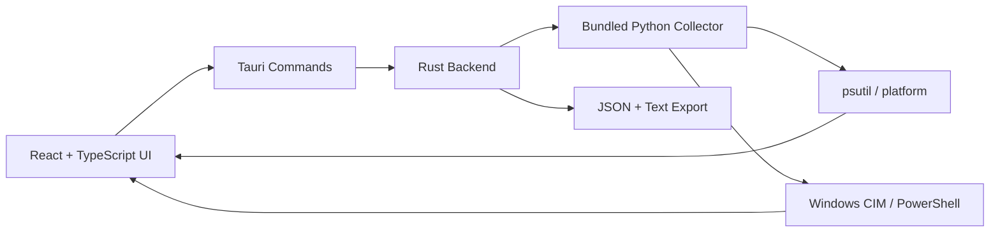

# SysInfo

<p align="center">
  <strong>Modern desktop system-information viewer with a Python collector and Tauri/React interface</strong>
</p>

<p align="center">
  
  
  
  
  
  
</p>
<p align="center">
  <a href="https://github.com/Danial-Zolfaghari/Sys-Info/actions/workflows/ci.yml"></a>
  <a href="https://github.com/Danial-Zolfaghari/Sys-Info/releases"></a>
  <a href="LICENSE"></a>
</p>


---

## Overview

**SysInfo** collects hardware and operating-system telemetry through a Python/psutil collector and presents it in a native Tauri desktop shell backed by a React + TypeScript frontend.

The repository includes the complete Tauri backend, collector bundling pipeline and Windows packaging scripts. Generated PyInstaller/Tauri build artifacts are intentionally excluded from source control.

## Platform support

| Platform | Collector | Desktop GUI / packaged build | Notes |
|---|---:|---:|---|
| Windows 10/11 x64 | ✅ Full | ✅ Full | Rich CIM/PowerShell hardware details |
| Linux | ⚠️ Partial | 🧪 Experimental | psutil/general fields work; Windows-specific hardware fields are unavailable |
| macOS | ⚠️ Partial | 🧪 Experimental | psutil/general fields work; Windows-specific hardware fields are unavailable |

The supplied `start.bat` and NSIS packaging workflow are Windows-focused.

## Download

The current Windows installer is available from [GitHub Releases](https://github.com/Danial-Zolfaghari/Sys-Info/releases/latest).

Release assets include:

- `SysInfo_1.0.0_x64-setup.exe` — Windows x64 installer
- `SHA256SUMS.txt` — SHA-256 checksum for verification

Verify the installer in PowerShell:

```powershell
Get-FileHash .\SysInfo_1.0.0_x64-setup.exe -Algorithm SHA256
```

## Architecture



## Data collected

- Operating system / architecture / host name
- CPU cores, model and frequency
- Total memory and Windows DIMM details
- Motherboard / BIOS data on Windows
- GPU details and VRAM helpers
- Storage utilization and media hints
- Network interfaces, IP and MAC addresses
- Battery state
- Boot time, uptime, local time and timezone

## Requirements

### Run a packaged Windows build

- Windows 10/11 x64
- Microsoft Edge WebView2 Runtime (normally already available on Windows 11)

The packaged application bundles its collector; Python is not required on the target system.

### Build from source

- Python 3.10+
- Node.js + npm
- Rust / Cargo
- Windows build tools for Tauri

Python build dependencies:

```text
psutil
PyInstaller
Pillow
```

## Development

Install frontend packages:

```powershell
cd gui
npm install
cd ..
```

Dev mode:

```bat
start.bat dev
```

## Build

```bat
start.bat build
```

The build pipeline:

1. installs/checks Python build dependencies
2. generates application icons
3. packages `collector/sys_info_collector.py` into a one-file collector with PyInstaller
4. copies the collector into Tauri resources
5. builds the React frontend
6. builds Tauri
7. creates installer + portable output folders

Expected outputs:

```text
output/installer/
output/portable/SysInfo.exe
```

## Project structure

```text
Sys-Info/
├─ collector/
│  └─ sys_info_collector.py
├─ gui/
│  ├─ src/
│  └─ src-tauri/
│     ├─ capabilities/
│     ├─ src/
│     ├─ Cargo.toml
│     └─ tauri.conf.json
├─ scripts/
│  ├─ generate_icons.py
│  └─ prepare_build.ps1
├─ requirements.txt
├─ requirements-build.txt
└─ start.bat
```

## Privacy

System reports may contain hostnames, MAC addresses, storage identifiers, motherboard/BIOS serials and local IP addresses. Review exported reports before sharing them publicly.

## Author

**Danial Zolfaghari** — [@Danial-Zolfaghari](https://github.com/Danial-Zolfaghari)
